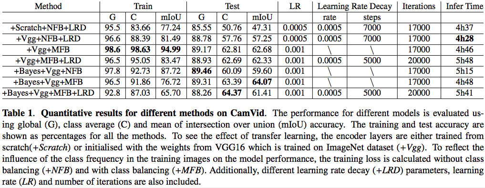
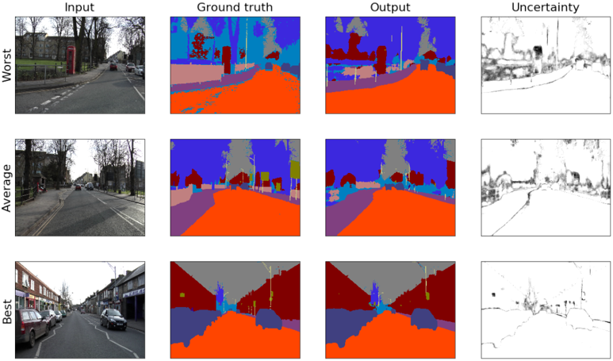

# SegNet- tensorflow implementation
The implementation for SegNet and Bayesian SegNet is based on two papers listed below: 

http://arxiv.org/abs/1511.02680
Alex Kendall, Vijay Badrinarayanan and Roberto Cipolla "Bayesian SegNet: Model Uncertainty in Deep Convolutional Encoder-Decoder Architectures for Scene Understanding." arXiv preprint arXiv:1511.02680, 2015.

http://arxiv.org/abs/1511.00561
Vijay Badrinarayanan, Alex Kendall and Roberto Cipolla "SegNet: A Deep Convolutional Encoder-Decoder Architecture for Image Segmentation." PAMI, 2017. 

# Result for our implementatioin 
Global accuracy (G), class average accuracy (C) and mean of intersection over union (mIoU) for different model based on the CamVid dataset is shown below:

Class accuracy for different models

Visualization for the predictions based on model SegNet-Bayes-Vgg-MFL

The saved model file for different models list above is saved in google drive folder: https://drive.google.com/drive/folders/1tD-4FsN6s8c45R81bjqIG_f5VCS1j-Db?usp=sharing 

# Usage
Requirement: Tensorflow-GPU 1.3.0
python: 3.6.0

